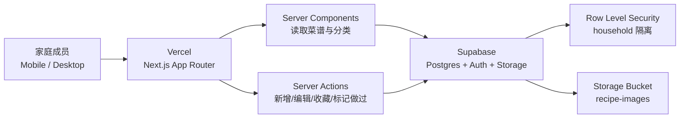

# 家庭菜单 App 产品设计与技术架构

## 1. 设计概念

家庭菜单 App 是一个面向家庭成员共享的菜谱与做饭灵感工具。用户打开应用后可以快速回答“今天吃什么”，也可以维护家庭常做菜、按分类和标签查找菜谱、记录最近做过的菜。

当前执行版本的核心模型：一户一个 `household`，全家共用同一个菜谱库。Next.js 服务端使用 Supabase service role key 读写数据，新增和编辑类写操作用家庭口令保护。

多成员账号、邀请加入、个人收藏等能力作为后续增强项保留在设计树里。

## 2. 目标与边界

### 2.1 产品目标

- 管理家庭菜谱：新增、编辑、删除、查看菜谱。
- 分类找灵感：按菜系、场景、食材、耗时、难度筛选。
- 降低决策成本：提供今日推荐、随机一道、最近少做、冰箱清库存等入口。
- 手机优先：移动端完成浏览、搜索、新增、拍照上传。
- 家庭共享：家庭成员共用菜谱库，权限由家庭空间隔离。

### 2.2 首版范围

- 单家庭空间自动初始化。
- 菜谱新增、查看。
- 分类管理。
- 标签管理。
- 图片上传设计。
- 搜索与筛选。
- 标记做过设计。
- 首页灵感推荐。
- Vercel 部署。

### 2.3 后续增强

- AI 根据食材生成菜谱建议。
- 从网页链接导入菜谱。
- OCR/拍照识别手写菜谱。
- 购物清单。
- 一周菜单规划。
- 营养与预算统计。
- PWA 离线访问。
- Supabase Auth、成员邀请、个人收藏。

## 3. 用户与场景

### 3.1 用户角色

- 家庭管理员：创建家庭空间、管理成员、维护分类。
- 家庭成员：浏览菜谱、新增菜谱、收藏菜谱、标记做过。

### 3.2 高频场景

- 晚饭前打开首页，随机找一道适合今天时间和食材的菜。
- 在超市里按分类和标签查看能买什么。
- 做完一道菜后记录“做过”，后续推荐降低重复频率。
- 家庭成员把自己的拿手菜添加到共享菜谱库。
- 看到冰箱里有鸡蛋、番茄、牛肉，按食材标签筛选灵感。

## 4. 信息架构

### 4.1 页面结构

- `/`：灵感首页
- `/recipes`：菜谱列表
- `/recipes/[id]`：菜谱详情
- `/recipes/new`：新增菜谱
- `/recipes/[id]/edit`：编辑菜谱
- `/categories`：分类管理
- `/settings`：家庭设置

### 4.2 移动端导航

底部导航建议 5 项：

- 灵感
- 菜谱
- 添加
- 分类
- 设置

首页主操作建议：

- 随机一道
- 按食材找
- 快手菜
- 最近少做
- 收藏菜

## 5. 功能设计

### 5.1 灵感首页

模块：

- 今日推荐：根据收藏、近期做过、耗时、分类偏好排序。
- 随机一道：从当前家庭菜谱库中随机抽取。
- 快捷筛选：快手菜、下饭菜、儿童、少油、汤粥、早餐。
- 间隔较长：按 `recipe_events` 中的最近做过时间排序。
- 最近新增：展示家庭成员新增的菜谱。

推荐规则 v1：

```text
score =
  favorite_bonus
  + tag_match_bonus
  + category_match_bonus
  + recency_decay_bonus
  - repeated_recently_penalty
```

### 5.2 菜谱列表

筛选维度：

- 分类
- 标签
- 食材关键词
- 耗时
- 难度
- 收藏
- 最近做过

排序方式：

- 最近更新
- 最近做过
- 收藏优先
- 耗时从短到长
- 随机

### 5.3 菜谱详情

字段展示：

- 封面图
- 菜名
- 分类
- 标签
- 耗时
- 难度
- 适合人数
- 食材清单
- 做法步骤
- 家庭备注
- 最近做过记录

操作：

- 收藏
- 标记做过
- 编辑
- 删除
- 分享给家庭成员

### 5.4 新增与编辑菜谱

手机表单采用分段结构：

1. 基础信息：菜名、分类、标签、封面图。
2. 做饭信息：耗时、难度、份量。
3. 食材：名称、数量、单位、备注。
4. 步骤：按顺序录入。
5. 家庭备注：口味调整、孩子喜好、替代食材。

图片上传流程：

1. 前端选择或拍摄图片。
2. Server Action 生成上传路径。
3. 上传到 Supabase Storage。
4. `recipes.image_path` 保存 Storage path。

### 5.5 分类与标签

默认分类：

- 家常菜
- 快手菜
- 汤粥
- 主食
- 早餐
- 便当
- 甜品
- 节日菜

标签由家庭成员自由创建。标签适合承载食材、口味、工具、家庭偏好，例如：

- 鸡肉
- 牛肉
- 少油
- 儿童
- 空气炸锅
- 下饭
- 清淡
- 冰箱清库存

## 6. 技术架构

### 6.1 推荐技术栈

- 应用框架：Next.js App Router
- 语言：TypeScript
- UI：Tailwind CSS + shadcn/ui
- 部署：Vercel
- 数据库：Supabase Postgres
- 认证：Supabase Auth
- 文件：Supabase Storage
- 权限：Supabase Row Level Security
- 数据访问：Server Components + Server Actions
- 客户端交互：小粒度 Client Components

### 6.2 架构图



### 6.3 Next.js 分层

```text
src/
  app/
    (auth)/
      login/
    (app)/
      page.tsx
      recipes/
      categories/
      settings/
    actions/
      recipes.ts
      categories.ts
      household.ts
  components/
    recipe-card.tsx
    recipe-form.tsx
    mobile-tabs.tsx
    filter-bar.tsx
  lib/
    supabase/
      server.ts
    db/
      types.ts
    recommendation.ts
  styles/
```

原则：

- Server Components 负责首屏数据读取。
- Server Actions 负责表单提交与数据变更。
- Client Components 负责筛选交互、弹窗、移动端导航和即时按钮反馈。
- Supabase 客户端采用懒加载封装，让运行时环境变量在请求阶段读取，提升 Vercel 构建稳定性。

### 6.4 Supabase 集成

当前执行版本采用 `@supabase/supabase-js` 在 Next.js 服务端创建 service role client。所有 Supabase 写入通过 Server Actions 进入，浏览器端只提交表单。

环境变量：

```bash
NEXT_PUBLIC_SUPABASE_URL=
SUPABASE_SERVICE_ROLE_KEY=
MENU_WRITE_PASSWORD=
MENU_HOUSEHOLD_NAME=家庭菜单
```

使用规则：

- 浏览器端只访问 Next.js 页面和 Server Actions。
- 服务端使用 `SUPABASE_SERVICE_ROLE_KEY` 读写 Postgres。
- 写操作校验 `MENU_WRITE_PASSWORD`。

### 6.5 Vercel 部署

环境：

- Development：本地开发。
- Preview：每个分支或 PR 的预览环境。
- Production：正式家庭使用入口。

部署策略：

- Vercel 负责 Next.js 构建、边缘网络、Serverless Functions。
- Supabase 环境变量分别配置到 Vercel Development / Preview / Production。
- 数据库迁移使用 Supabase CLI 或 SQL migration 文件管理。
- Preview 环境可连接独立 Supabase 项目，降低测试数据影响。

## 7. 数据模型

### 7.1 表结构

```sql
create table households (
  id uuid primary key default gen_random_uuid(),
  name text not null,
  created_by uuid references auth.users(id),
  created_at timestamptz not null default now()
);

create table household_members (
  household_id uuid not null references households(id) on delete cascade,
  user_id uuid not null references auth.users(id) on delete cascade,
  role text not null check (role in ('owner', 'member')),
  created_at timestamptz not null default now(),
  primary key (household_id, user_id)
);

create table categories (
  id uuid primary key default gen_random_uuid(),
  household_id uuid not null references households(id) on delete cascade,
  name text not null,
  sort_order int not null default 0,
  created_at timestamptz not null default now(),
  unique (household_id, name)
);

create table tags (
  id uuid primary key default gen_random_uuid(),
  household_id uuid not null references households(id) on delete cascade,
  name text not null,
  created_at timestamptz not null default now(),
  unique (household_id, name)
);

create table recipes (
  id uuid primary key default gen_random_uuid(),
  household_id uuid not null references households(id) on delete cascade,
  category_id uuid references categories(id) on delete set null,
  title text not null,
  description text,
  difficulty text check (difficulty in ('easy', 'medium', 'hard')),
  cook_time_minutes int,
  servings int,
  image_path text,
  ingredients jsonb not null default '[]'::jsonb,
  steps jsonb not null default '[]'::jsonb,
  notes text,
  created_by uuid references auth.users(id),
  created_at timestamptz not null default now(),
  updated_at timestamptz not null default now()
);

create table recipe_tags (
  recipe_id uuid not null references recipes(id) on delete cascade,
  tag_id uuid not null references tags(id) on delete cascade,
  primary key (recipe_id, tag_id)
);

create table recipe_favorites (
  recipe_id uuid not null references recipes(id) on delete cascade,
  user_id uuid not null references auth.users(id) on delete cascade,
  created_at timestamptz not null default now(),
  primary key (recipe_id, user_id)
);

create table recipe_events (
  id uuid primary key default gen_random_uuid(),
  recipe_id uuid not null references recipes(id) on delete cascade,
  user_id uuid not null references auth.users(id) on delete cascade,
  event_type text not null check (event_type in ('cooked', 'viewed')),
  metadata jsonb not null default '{}'::jsonb,
  created_at timestamptz not null default now()
);

create table household_invites (
  id uuid primary key default gen_random_uuid(),
  household_id uuid not null references households(id) on delete cascade,
  invite_code text not null unique,
  created_by uuid not null references auth.users(id),
  expires_at timestamptz,
  created_at timestamptz not null default now()
);
```

### 7.2 索引

```sql
create index recipes_household_updated_idx
  on recipes (household_id, updated_at desc);

create index recipes_household_category_idx
  on recipes (household_id, category_id);

create index recipe_events_recipe_created_idx
  on recipe_events (recipe_id, created_at desc);

create index recipe_events_user_created_idx
  on recipe_events (user_id, created_at desc);

create index tags_household_name_idx
  on tags (household_id, name);
```

### 7.3 RLS 策略思路

所有业务表启用 RLS：

```sql
alter table households enable row level security;
alter table household_members enable row level security;
alter table categories enable row level security;
alter table tags enable row level security;
alter table recipes enable row level security;
alter table recipe_tags enable row level security;
alter table recipe_favorites enable row level security;
alter table recipe_events enable row level security;
alter table household_invites enable row level security;
```

核心判断函数：

```sql
create or replace function is_household_member(target_household_id uuid)
returns boolean
language sql
security definer
set search_path = public
as $$
  select exists (
    select 1
    from household_members
    where household_id = target_household_id
      and user_id = auth.uid()
  );
$$;
```

菜谱访问策略：

```sql
create policy "members can read recipes"
  on recipes for select
  using (is_household_member(household_id));

create policy "members can create recipes"
  on recipes for insert
  with check (is_household_member(household_id) and created_by = auth.uid());

create policy "members can update recipes"
  on recipes for update
  using (is_household_member(household_id));

create policy "members can delete recipes"
  on recipes for delete
  using (is_household_member(household_id));
```

Storage bucket：

- bucket：`recipe-images`
- path：`{household_id}/{recipe_id}/{file_name}`
- 读取：家庭成员可读。
- 上传：家庭成员可上传到所属 household 路径。
- 删除：家庭成员可删除所属 household 路径。

## 8. API 与 Server Actions

首版优先使用 Server Actions：

```text
createRecipe(formData)
updateRecipe(recipeId, formData)
deleteRecipe(recipeId)
toggleFavorite(recipeId)
markCooked(recipeId)
createCategory(name)
renameCategory(categoryId, name)
deleteCategory(categoryId)
createInvite()
joinHousehold(inviteCode)
```

Route Handlers 适合以下能力：

- 图片预签名上传。
- 外部导入 webhook。
- 后续 AI 菜谱生成。
- 数据导出。

## 9. 权限与安全

关键原则：

- 数据隔离以 `household_id` 为主线。
- 业务读取和写入由 RLS 执行最终权限判断。
- Service Role Key 放在 Vercel 服务端环境变量。
- 邀请码设置过期时间和创建人。
- 删除菜谱时同步清理图片与关联记录。

## 10. 响应式设计

### 10.1 手机端

- 首页突出“随机一道”和快捷筛选。
- 列表卡片采用单列。
- 筛选器放入底部抽屉。
- 新增菜谱采用分步表单。
- 图片上传放在表单第一屏。

### 10.2 桌面端

- 左侧分类栏。
- 中间菜谱列表。
- 右侧可放推荐、最近做过、收藏。
- 筛选器常驻顶部。

### 10.3 UI 风格

适合家庭工具的视觉方向：

- 清爽、温暖、信息密度适中。
- 卡片圆角控制在 8px 左右。
- 使用真实菜谱图片增强灵感感受。
- 操作按钮采用图标加短文本。
- 移动端点击区域保持充足高度。

## 11. 实施计划

### Phase 1：项目骨架

- 初始化 Next.js App Router。
- 配置 Tailwind 与 shadcn/ui。
- 配置 Supabase 环境变量。
- 建立 Supabase server/browser client。
- 建立基础布局与移动端导航。

### Phase 2：数据与权限

- 创建数据库 migration。
- 启用 RLS。
- 创建 Storage bucket。
- 实现登录、创建家庭空间、加入家庭空间。

### Phase 3：菜谱核心

- 实现菜谱列表。
- 实现新增与编辑。
- 实现详情页。
- 实现图片上传。
- 实现分类和标签。

### Phase 4：灵感功能

- 首页推荐。
- 随机一道。
- 最近少做。
- 收藏优先。
- 标记做过。

### Phase 5：上线验证

- Vercel Preview 部署。
- 手机端实测核心路径。
- RLS 隔离测试。
- 图片上传与删除测试。
- Production 发布。

## 12. 验收标准

- 用户可以登录并进入所属家庭空间。
- 家庭成员可以共享同一菜谱库。
- 用户可以新增、编辑、删除菜谱。
- 用户可以上传菜谱封面。
- 用户可以按分类、标签、关键词查找菜谱。
- 首页可以提供随机菜谱和推荐菜谱。
- 手机端可以完成从找菜到标记做过的完整路径。
- RLS 可以隔离各 household 的数据。
- Vercel Preview 和 Production 环境都能连接对应 Supabase 项目。

## 13. 参考文档

- Supabase Next.js SSR 客户端与 Cookie session：https://github.com/supabase/supabase/blob/master/apps/docs/content/guides/auth/server-side/creating-a-client.mdx
- Supabase RLS 与 Storage policy 示例：https://github.com/supabase/supabase/blob/master/examples/user-management/ionic-angular-user-management/README.md
- Vercel Next.js App Router Functions：https://vercel.com/docs/functions/quickstart
- Vercel 环境变量：https://vercel.com/docs/environment-variables
